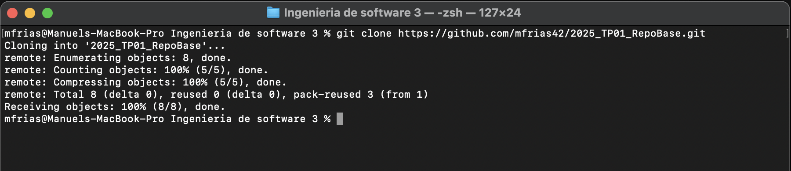
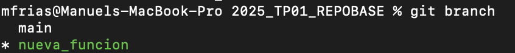
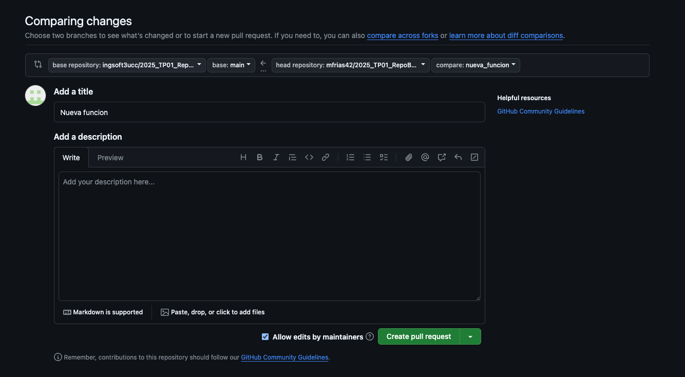
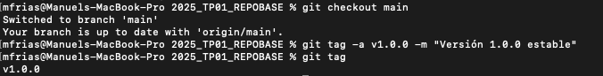

Para configurar mi perfil de github en el sistema:

git config --global user.name "mfrias42" git config --global user.email "friasmanuel42@gmail.com"

procedo a hacer un fork a mi cuneta del repositorio base y lo clono 

Creo la nueva rama para mi funcion:

Me muevo a la rama que cree:

Muestro que estyoy en la rama que cree:

Agrego la nueva funcion que recibe el nombre del usuario y genera un saludo amigable, hago un commit de los cambios en la rama 'nueva_funcion':

Ahora agrego una nueva funcion de calcular edad segun al fecha de nacimiento y hago el commit de la funcion en la rama 'nueva_funcion':

Creo la rama hotfix para mejorar el menu de bienvenida a la aplicacion 

Una vez hechos los cambios hago un commit a la rama hotfix 

Procedo a hacer un merge de la rama hotfix a la rama main: 

Ahora mergeo hotfix con nueva funcion, resuelvo los conflictos entre las ramas y hago un commit con los cambios:

Hago un pull request para solicitar la fusion de la rama 'nueva_funcion' en la rama 'main':

Ahora le agrego un tag para definir la v1 estable:

