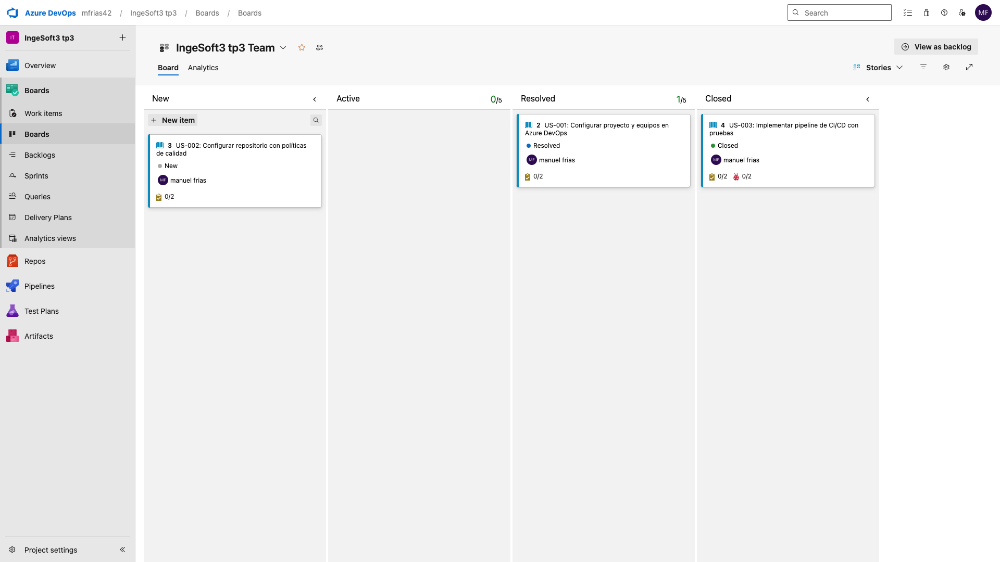
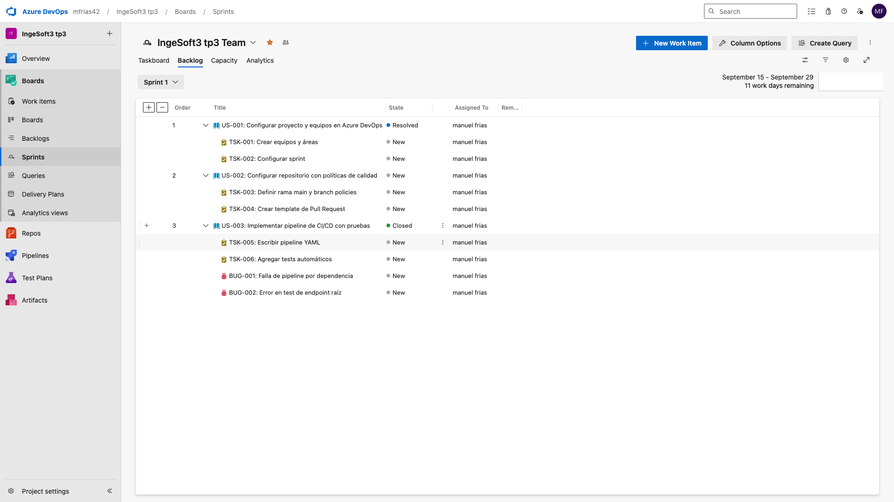
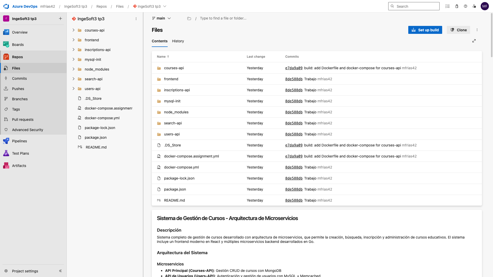
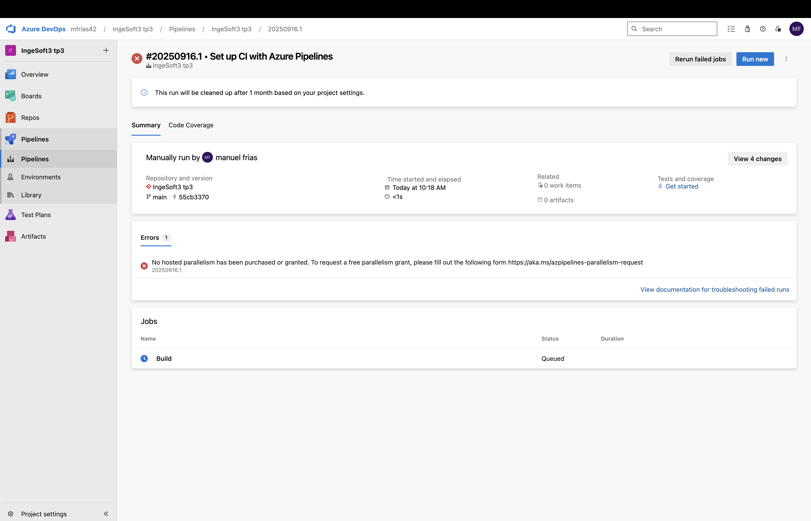

Decisiones Técnicas - TP3
Metodología ágil elegida y justificación
Se eligió el proceso Agile de Azure DevOps por su flexibilidad y adaptación a equipos pequeños y proyectos académicos. Permite organizar el trabajo en ciclos cortos, priorizar tareas y gestionar cambios de manera eficiente, facilitando la colaboración y el seguimiento del avance.

Estructura de work items y por qué
Epics: Agrupan funcionalidades principales y objetivos generales del proyecto.
User Stories: Representan necesidades y requisitos funcionales desde la perspectiva del usuario.
Tasks: Descomponen las User Stories en actividades técnicas concretas, facilitando la asignación y el control de progreso.
Bugs: Permiten registrar y gestionar errores detectados durante el desarrollo y pruebas.
Esta estructura asegura trazabilidad, claridad en la asignación de responsabilidades y seguimiento efectivo del avance del proyecto.

Evidencia de funcionamiento
Board con work items organizados

Sprint con work items

Cargo el repositorio

Me da error al no tener habilitacion de azure devops
